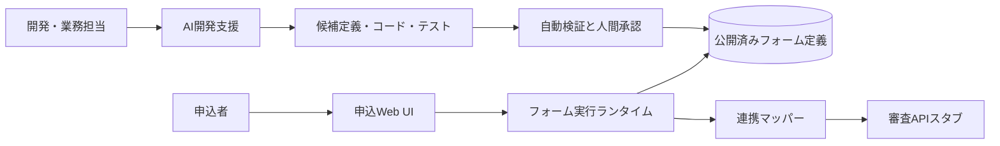

# スコープ

## 1. PoC対象

| ID | 対象 | 内容 |
|---|---|---|
| SCP-01 | 初期商品 | 特定銀行の標準的カードローン1商品（詳細は未決） |
| SCP-02 | 申込UI | 本人、勤務先・収入、契約、確認・同意、完了 |
| SCP-03 | 定義管理 | 項目、表示、選択肢、ルール、順序、マッピング、文面、版 |
| SCP-04 | 決定的実行 | 表示・必須・入力検証・セクション遷移・送信前検証 |
| SCP-05 | AI開発支援 | 要件構造化、影響分析、定義・コード・テスト生成、仕様更新、不整合検出 |
| SCP-06 | 連携 | 審査APIスタブへの正規化済みペイロード変換 |
| SCP-07 | 横展開 | 2商品目と別銀行の模擬 |
| SCP-08 | 計測 | 開発工程、品質、UXイベント、承認の記録と評価 |
| SCP-09 | 品質 | スマホファースト、主要導線のWCAG 2.2 AA確認、セキュリティ基本検証 |

## 2. PoC対象外

| ID | 対象外 | 理由／将来扱い |
|---|---|---|
| OOS-01 | 実与信・審査ロジック | AI Native開発方式の評価範囲を超え、銀行承認が必要 |
| OOS-02 | 本番勘定・審査システム接続 | スタブで契約境界のみ検証 |
| OOS-03 | 本番個人情報・本人確認 | 合成データを使用。eKYC方式は未決 |
| OOS-04 | 電子契約・融資実行・返済 | 申込受付後の業務は対象外 |
| OOS-05 | 24/365本番運用・DR認定 | 非機能設計案まで。認定試験は本番化フェーズ |
| OOS-06 | AIによる申込可否・与信・不正判定 | 決定責任と説明可能性の原則に反する |
| OOS-07 | 本格的な管理画面 | PoCはGit等で管理された定義変更フローを優先 |
| OOS-08 | 全ブラウザ・全支援技術の認証 | 代表構成で検証し、網羅認証は本番化フェーズ |

## 3. 境界

AIは申込者の本番実行経路外に置く。PoCの内部設計はマルチテナントを想定するが、運用分離・契約分離の本番要件は未決とする。

## 4. シナリオとの対応

- Scenario A: SCP-01〜06, 08, 09
- Scenario B: SCP-03〜06, 08
- Scenario C: SCP-03〜08
- Scenario D: SCP-03〜08（認証はモック差分）

詳細は [11_change_scenarios.md](11_change_scenarios.md)。

