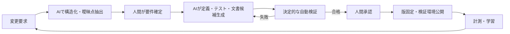

# AI Native開発方式の定義

## 1. 定義

本PoCにおけるAI Native開発とは、AIを単発のコーディング補助ではなく、要件から公開までの工程に組み込み、機械可読な実行可能仕様と証跡を中心に、生成・検証・承認・保守を循環させる開発方式である。

## 2. 責任境界

| ID | 活動 | AI | 決定的プログラム | 人間 |
|---|---|---|---|---|
| AIN-01 | 自然言語要件の構造化 | 候補生成、曖昧点抽出 | スキーマ検証 | 業務要件を確定 |
| AIN-02 | 影響分析 | 変更候補・依存関係を提示 | 参照・型・差分解析 | 影響範囲を承認 |
| AIN-03 | 定義・コード生成 | PR候補を生成 | lint、型、テスト、禁止事項検査 | レビュー・承認 |
| AIN-04 | テスト生成 | 境界値・組合せ・回帰候補生成 | テスト実行、カバレッジ計測 | 十分性を判断 |
| AIN-05 | 仕様同期 | 文書更新候補、不一致説明 | ID・リンク・契約整合性検査 | 正式仕様を承認 |
| AIN-06 | 申込時の表示・必須・検証 | 使用しない | 公開済み版を決定的評価 | 例外・制度を事前承認 |
| AIN-07 | 審査・申込可否判断 | 使用しない | 外部審査契約へ受け渡しのみ | 銀行が責任を持つ |
| AIN-08 | 公開 | 使用しない | ゲートと署名・版固定 | 権限者が承認 |

## 3. AI Native部分と通常開発部分

AI Native部分は、要件構造化、変更影響分析、候補生成、テスト生成、トレーサビリティ更新、不整合検出、レビュー要約である。通常開発部分は、ランタイム、ルール評価器、認証認可、暗号化、監査、APIアダプター、CI/CDゲート、観測基盤であり、AIなしでも決定的に動作しなければならない。

## 4. AI利用統制要件

| ID | 要件 |
|---|---|
| AIG-01 | 入力に本番個人情報、秘密情報、未承認の機密文書を含めない |
| AIG-02 | モデル、プロンプト、参照資料、生成時刻、生成物ハッシュを記録する |
| AIG-03 | 生成物は候補ブランチでのみ作成し、直接公開を禁止する |
| AIG-04 | 構文・スキーマ・参照・ルール安全性・テスト・セキュリティ検査を自動化する |
| AIG-05 | 業務・法令・同意文・審査マッピングは担当者承認を必須とする |
| AIG-06 | AI失敗時も手動変更と決定的ビルドが可能である |
| AIG-07 | 生成物の採用、修正、棄却理由を記録しMET-05/MET-06へ利用する |
| AIG-08 | モデル更新時は固定評価セットで回帰評価してから利用する |

## 5. 非AI Nativeとの判別基準

単にAIでコードを書いた、チャット履歴だけに仕様がある、生成物を無検証で採用する、実行時判断をLLMへ委譲する方式は本PoCのAI Nativeには含めない。

## 6. 変更ループ

