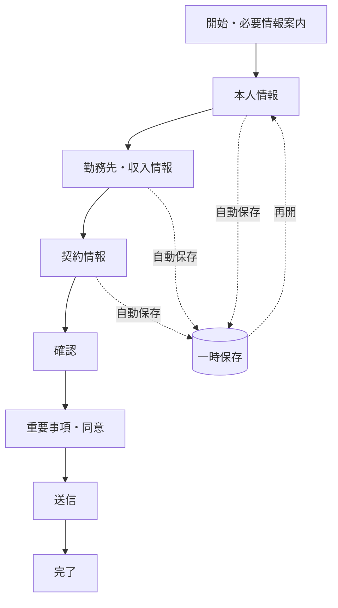

# UX原則

## 1. 最優先成果

UXの第一目的は、必要な説明・同意・入力品質を維持しながら、意図しない途中離脱を減らすことである。入力完了率だけを最適化し、説明や選択の自由を損なってはならない。

| ID | 原則 | 設計ルール | 検証 |
|---|---|---|---|
| UX-001 | 小さく進める | 1画面の認知負荷を抑え、意味単位のセクションに分割する | 完了時間、離脱率、ユーザーテスト |
| UX-002 | 先を予測できる | 目的、必要情報、進捗、所要時間の目安を示す | 理解度質問、戻る操作率 |
| UX-003 | 入力を失わない | 戻る・通信障害・再開で回答を保持する | 障害・再開試験 |
| UX-004 | エラーを予防する | 適切な入力型、例、選択肢、許容形式を入力前に示す | 初回エラー率 |
| UX-005 | 修正しやすい | エラーは項目近傍と要約に示し、原因と直し方を具体化する | エラー回復率・時間 |
| UX-006 | 必要な時だけ聞く | 条件外項目は表示せず、非表示値を送信しない | 分岐テスト |
| UX-007 | スマホを基準にする | 片手操作、適切なキーボード、十分なタップ領域、ズーム可能 | 代表実機試験 |
| UX-008 | アクセシブルにする | ラベル、フォーカス、読み上げ順、状態通知、色以外の手掛かりを保証 | WCAG 2.2 AA検査 |
| UX-009 | 信頼を説明する | 収集理由、利用目的、保存、外部連携を文脈内で説明する | 信頼性インタビュー |
| UX-010 | 強制・誘導を避ける | 同意と重要事項を省略・事前選択せず、拒否時の結果を明示する | コンプライアンスレビュー |
| UX-011 | 一貫させる | 共通部品と文体を使い、銀行差分はトークン・文言定義に閉じる | UI回帰・ブランドレビュー |
| UX-012 | 計測可能にする | PIIなしで閲覧、エラー、戻る、離脱、再開、完了を測る | イベントスキーマ検査 |

## 2. 主要フロー

実際のセクション順序と分岐はフォーム定義を正とし、本図は標準フローの仮定である。

## 3. エラーと条件分岐

- 入力中は書式補助を優先し、妨げになる早すぎるエラーを避ける。
- セクション移動時に当該セクションを完全検証し、送信時にサーバーで全体を再検証する。
- 条件変更で項目が非表示になった場合、値の保持・消去方針は項目定義で明示する。既定は送信対象から除外し、機微情報は消去する。
- セッション切れ、連携失敗、重複送信は通常の入力エラーと区別する。

## 4. UX評価指標

`start_rate`、セクション別離脱率、完了率、中央値完了時間、項目別初回エラー率、エラー回復率、戻る率、保存再開成功率を `bank_id/product_id/form_version` と端末区分で集計する。小標本では有意差を主張せず、定性観察と併記する。

## 5. 未決事項

対象顧客層、対応言語、保存再開の本人確認、所要時間表示、チャット支援の有無、アクセシビリティ試験対象環境は [13_risks_and_open_questions.md](13_risks_and_open_questions.md) で管理する。

