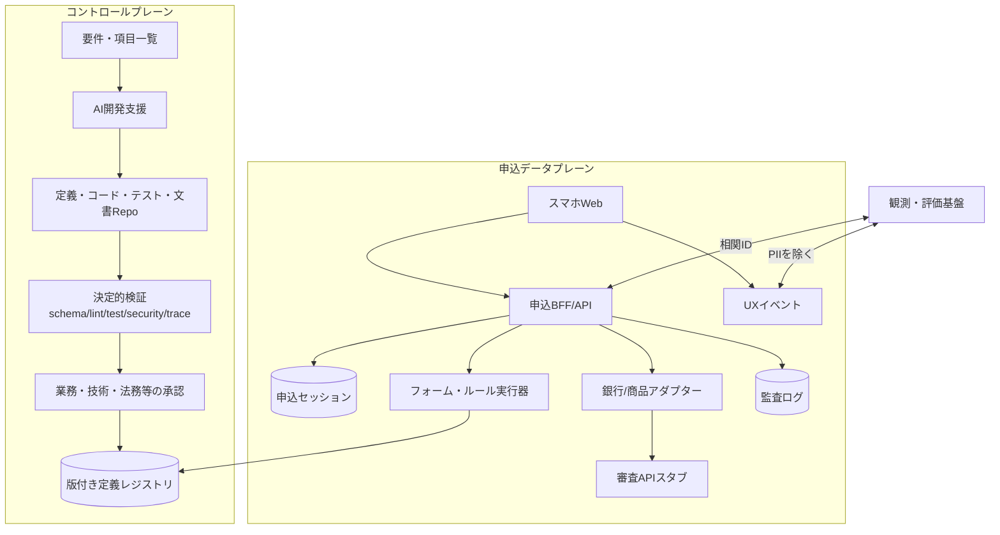
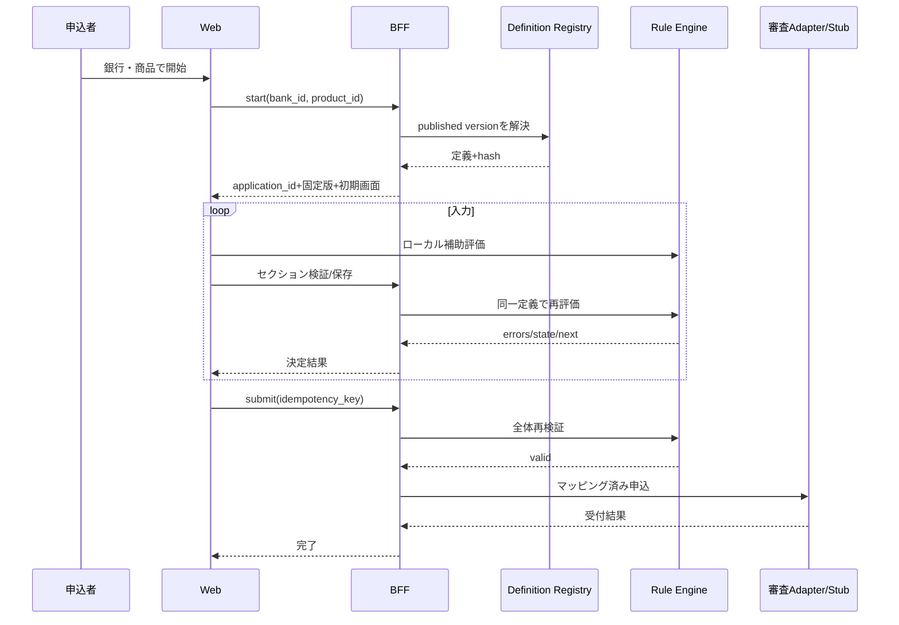

# システムアーキテクチャ

## 1. 方針

- コントロールプレーン（定義作成・検証・公開）とデータプレーン（申込実行）を分離する。
- 実行時は公開済みの解決済み定義だけを読み、AIサービスを呼ばない。
- 銀行・商品差分は定義、ブランド、認証、外部APIアダプターへ局所化する。
- 申込セッションは開始時の `bank_id/product_id/form_version` に固定する。

## 2. 論理構成

## 3. コンポーネント責務

| ID | コンポーネント | 責務 | 禁止事項 |
|---|---|---|---|
| ARC-01 | Web UI | 定義レンダリング、入力補助、アクセシビリティ、UXイベント | クライアントだけで業務妥当性を確定しない |
| ARC-02 | 申込BFF/API | セッション、版固定、サーバー再検証、冪等送信 | 銀行固有分岐を散在させない |
| ARC-03 | Form Runtime | 解決済み定義から表示・必須・遷移を決定的評価 | 任意コード・LLM呼出し |
| ARC-04 | Rule Engine | 型付き演算子で検証・条件を評価し説明可能な結果を返す | eval、動的スクリプト、外部I/O |
| ARC-05 | Definition Registry | 承認済み不変版の保存、取得、ハッシュ検証 | ドラフトを配信しない |
| ARC-06 | Adapter Layer | 認証、API契約、マッピング、エラー正規化 | UI項目IDへ直接依存しすぎない |
| ARC-07 | AI Dev Assistant | 候補生成、影響分析、不整合検出 | 公開、本番判定、無承認確定 |
| ARC-08 | CI/Policy Gate | 構文、型、参照、経路、テスト、セキュリティ、証跡検査 | 人間承認の代替 |
| ARC-09 | Audit/Observability | 監査・運用・評価証跡の分離記録 | 回答値の平文記録 |

## 4. 主要データ

| データ | キー | 版管理 | PII |
|---|---|---|---|
| FormDefinition | bank/product/form_version | 不変 | なし |
| ApplicationSession | application_id + definition key | 状態遷移 | あり |
| ConsentRecord | application_id + consent_version | 追記 | 最小限 |
| GenerationRecord | generation_id + artifact hash | 追記 | 禁止 |
| ApprovalRecord | artifact hash + gate | 追記 | 担当者ID |
| EvaluationEvent | scenario_run_id + event_id | 追記 | なし |

## 5. 申込時シーケンス

## 6. マルチ銀行・商品構成

論理キーで分離し、共通テンプレート → 銀行ベース → 商品差分の順に合成する。ただし継承の複雑化を避けるため最大3層とし、公開時に完全な解決済みスナップショットを生成する。実行時の動的マージは禁止する。

## 7. セキュリティ境界

- ブラウザ、定義作成環境、公開レジストリ、外部連携を別信頼境界とする。
- クライアント評価はUX補助であり、送信前にサーバーで同一定義を再評価する。
- 定義にHTML、SQL、正規表現の無制限入力、実行コードを許可しない。
- 監査ログ、運用ログ、分析イベント、申込データを分離する。

## 8. PoCから本番への追加事項

高可用性、DR、鍵管理、データ所在、保持削除、SOC/SIEM、WAF、レート制限、eKYC、外部審査接続、運用手順、脆弱性診断、性能容量、銀行ごとのネットワーク分離は本番化評価で具体化する。

