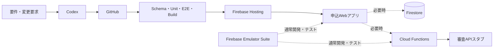

# システムアーキテクチャ

## PoC-1推奨構成

最初は静的Webアプリ、ビルド時フォーム定義、ブラウザ内またはローカルAPIスタブだけで縦切りを完成させる。FirestoreとFunctionsは必須ではない。

## 最小コンポーネント

| ID | 要素 | 責務 |
|---|---|---|
| ARC-01 | GitHub | 定義、コード、テスト、文書、worklogの正 |
| ARC-02 | Web UI | スマホ表示、入力補助、定義レンダリング |
| ARC-03 | Form/Rule Runtime | 表示、必須、検証、遷移の決定的実行 |
| ARC-04 | Local/Browser Stub | 実審査を行わない合成レスポンス |
| ARC-05 | GitHub Actions | Schema、Unit、E2E、build |
| ARC-06 | Firebase Hosting | 必要な節目だけ静的アプリを公開 |
| ARC-07 | Emulator Suite | Firestore/Functions/Rulesの通常開発・テスト |

## オプションサービス

- Firestore: 公開定義、合成セッション、簡易途中保存、評価イベント。定義をキャッシュし、不要なlistenerと細粒度イベントを避ける。
- Cloud Functions: 最終入力検証、冪等受付、APIスタブ送信。最小インスタンス0、コールドスタート許容、入力ごとの呼出し禁止。
- Authentication: PoC-2の途中保存で再判断。PoC-1では電話認証を使わない。
- App Check、Analytics、Performance Monitoring: 必要性と料金・データ影響を確認してから採否を決める。

## 版と追跡

`bank_id/product_id/form_version` は設定ファイルに持ち、フォーム定義はビルド時に取り込む。Definition Registryや署名は作らず、Gitコミットハッシュと定義ファイルハッシュで追跡する。

## セキュリティ境界

PoC-1のクライアント検証は本番セキュリティではない。本番では信頼できるサーバーで同じルールを再検証する必要がある。Functionsを採用した場合のみPoC内でも最終検証を追加できるが、実与信や本番適合を意味しない。

## デプロイ方針

通常開発はローカルで行い、縦切り完成、主要変更、スマホ実機確認、最終デモのときだけFirebaseへデプロイする。課金可能性のある構成変更はCodexだけで実施しない。
