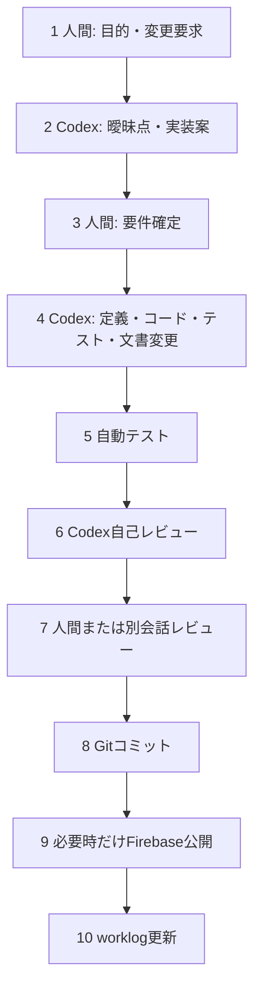

# Codex主体の開発ワークフロー

## 標準フロー

## 最低ゲート

| ID      | 検査                                 | 失敗時           |
| ------- | ------------------------------------ | ---------------- |
| GATE-01 | JSON Schema、型、参照                | 修正して再実行   |
| GATE-02 | ルールUnit・代表経路                 | 修正して再実行   |
| GATE-03 | UI E2E・build                        | 公開しない       |
| GATE-04 | secret・合成データ・本番利用不可表示 | 公開しない       |
| GATE-05 | Git差分と文書リンク                  | コミット前に修正 |

企業向け多人数承認や公開システムは作らない。課金可能性のあるサービス追加とFirebaseデプロイは人間が最終判断する。

## 簡易worklog

`docs/worklogs/YYYY-MM-DD-topic.md` またはCSVへ以下を残す。

- 作業内容と関連要件ID
- Codexへの主な指示
- 開始・終了時刻と実作業時間
- Codexが作成した内容
- 人間が修正した内容と理由
- 実行したテストと結果
- 発生した問題
- 次回改善点
- 基盤構築／初期商品／変更／横展開の区分

本格的な生成台帳アプリ、プロンプト全文の恒久保存、改ざん防止基盤は作らない。

## デプロイ方針

日常の小変更ではクラウドへデプロイしない。ローカルとEmulator Suiteで確認し、PoC-1縦切り完成、主要変更シナリオ、スマホ実機確認、最終デモの節目だけFirebase Hostingへ公開する。

## StudioからCodexへ渡す入力

Studioの`form-definition.json`を正とし、`change-manifest.json`、項目・validator・rule・未解決事項のMarkdown、`scenarios.json`を同時レビューする。形式は[Studio出力形式](form-studio/export-format.md)を参照する。Codexは既存ランタイムで表現できない項目形式や機能だけをコード変更候補とする。
