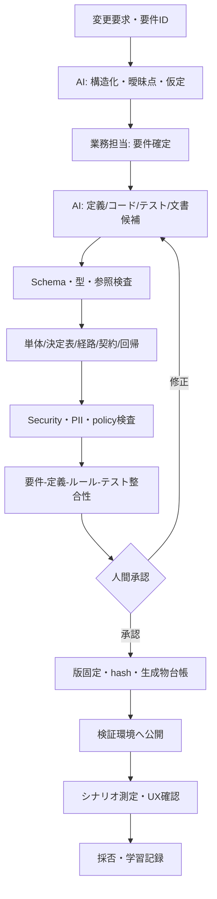

# AI Native開発ワークフロー

## 1. 成果物中心の流れ

## 2. 工程と責任

| ID | 工程 | 入力 | 出力・完了条件 | 主責任 |
|---|---|---|---|---|
| WF-01 | Intake | 変更要求、根拠 | `change_request_id`、目的・受入条件・未決事項 | Product/業務 |
| WF-02 | Structure | WF-01 | AI構造化案、仮定、質問、影響仮説 | AI作成、人間確定 |
| WF-03 | Generate | 確定要件 | 追跡ID付き候補差分と生成記録 | AI/開発者 |
| WF-04 | Deterministic gates | 候補差分 | 全自動ゲートの機械可読結果 | CI |
| WF-05 | Review | 合格差分 | 業務・UX・技術・必要な法務/セキュリティ承認 | 各責任者 |
| WF-06 | Publish | 承認済みhash | 不変版、公開記録、ロールバック対象 | Release責任者 |
| WF-07 | Evaluate | 公開版、シナリオ | 指標、問題、採否、改善項目 | PoCオーナー |

## 3. 自動ゲート

| Gate | 検査 | 失敗時 |
|---|---|---|
| G-01 Structure | Schema、format、型 | 公開停止 |
| G-02 Reference | ID、参照、翻訳、同意版 | 公開停止 |
| G-03 Rule safety | 許可演算子、循環、矛盾、ReDoS | 公開停止 |
| G-04 Tests | unit、decision table、path、contract、regression | 公開停止 |
| G-05 Coverage | 閾値と未テスト差分 | 公開停止または承認例外 |
| G-06 Security/privacy | secret、PII、SAST、依存関係 | 公開停止 |
| G-07 Traceability | 要件↔定義↔ルール↔テスト | 公開停止 |
| G-08 Diff policy | 変更種別別の必要承認 | 承認待ち |

## 4. 変更種別と承認

| 変更 | 最低承認 |
|---|---|
| 表示文言・順序・任意項目 | Product/UX、技術 |
| 必須、入力チェック、条件分岐 | 業務、技術、QA |
| 審査マッピング・認証 | 銀行連携責任者、セキュリティ、技術 |
| 同意文・法令関連 | 法務/コンプライアンス、業務 |
| スキーマ・ランタイム | アーキテクト、セキュリティ、QA |

銀行の正式な職務分掌が未確定のため、これはPoC用の仮定である。

## 5. AI生成記録

`generation_id`、`change_request_id`、モデル識別子、モデル設定、プロンプトテンプレート版、参照資料ID/hash、入力分類、出力artifact/hash、開始終了時刻、ツール版、採用状態、修正行数、棄却理由を記録する。プロンプト本文の保存可否と保持期限はセキュリティ判断待ち。

## 6. 仕様同期

フォーム定義を実行の正とする一方、企画目的・責任・リスクはMarkdownを正とする。生成処理は定義から項目表・ルール表・経路図・API写像・テスト対応表を再生成し、手編集領域と生成領域を混在させない。

## 7. 緊急変更とロールバック

PoCでは緊急変更も通常ゲートを省略しない。公開は版の切替で行い、旧版を保持する。新規開始を旧版へ戻せるが、進行中申込の版は原則変更しない。

## 8. 不一致の扱い

検出された不一致は `INC-{連番}` として、検出元、対象ID、重大度、原因（要件/定義/実装/テスト/文書）、流出工程、修正時間を記録する。単なる表現差ではなく、期待動作・契約・追跡関係が異なるものをMET-08で数える。

