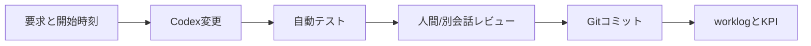

# 変更シナリオ

## PoC-1

| ID | シナリオ | 完了条件 | 主KPI |
|---|---|---|---|
| SC1-01 | 新規フォーム作成 | 15〜25項目、3〜5分岐、確認・完了が動く | KPI-01,04 |
| SC1-02 | 項目追加 | 定義変更を反映しSchema・回帰テスト合格 | KPI-02,03,07 |
| SC1-03 | 必須・任意変更 | 表示状態との矛盾なく反映 | KPI-02,05,07 |
| SC1-04 | 選択肢追加 | 既存値を壊さず選択可能 | KPI-02,03,07 |
| SC1-05 | 条件分岐追加 | 新旧の代表経路がテスト合格 | KPI-02,05,07 |

各シナリオは1変更要求ずつ行い、BASE、PRODUCT1、CHANGEの実作業時間を分ける。クラウド公開は全変更ごとではなく、主要変更がまとまった節目に行う。

## PoC-2

| ID | シナリオ | 見ること |
|---|---|---|
| SC2-01 | 項目削除 | 残存参照と回帰 |
| SC2-02 | 画面順序変更 | 進捗、戻る、入力保持 |
| SC2-03 | APIマッピング変更 | スタブ契約差分 |
| SC2-04 | 同意文変更 | 単純な文面版管理。正式同意ではない |
| SC2-05 | 2商品目 | 共通ランタイムと商品差分、KPI-08 |
| SC2-06 | 別銀行模擬 | ブランド・文言・条件差分、KPI-09 |
| SC2-07 | 途中保存・再開 | 合成データ、必要ならAuth/Firestore |

## 実施フロー

実在データ、実審査、本番APIはどのシナリオでも使わない。
