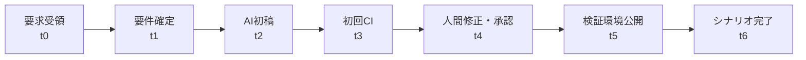

# 変更シナリオ

## 1. 共通実施手順

各シナリオは、入力要件凍結 → 作業 → 自動検証 → 人間承認 → 検証環境公開 → 証跡凍結 → 振り返りの順で行う。シナリオ中に判明した業務不明点は勝手に補完せず、仮定または未決として記録する。

## 2. Scenario A: 新規構築

| ID | 変更パッケージ | 完了条件 | 計測 |
|---|---|---|---|
| SC-A-01 | 自然言語要件と項目一覧の構造化 | 仮定・質問・要件IDがレビュー済み | MET-01/02/06/08 |
| SC-A-02 | 1銀行1商品の定義生成 | Schema・参照・経路検証合格 | MET-05/06 |
| SC-A-03 | UI・ルール・APIスタブ連携 | 代表E2E、アクセシビリティ、契約テスト合格 | MET-01/07 |
| SC-A-04 | 仕様・テスト・証跡生成 | 全FRとルールにテスト参照 | MET-08 |

標準項目の具体内容は業務担当から提供されるまで仮定データセットを使い、成果を商品要件として扱わない。

## 3. Scenario B: 商品変更

各変更を原則1件ずつ独立した `change_request_id` で行い、複合変更の相互作用は最後に別パッケージで試験する。

| ID | 変更 | 期待する主変更面 | 必須回帰 |
|---|---|---|---|
| SC-B-01 | 項目追加 | definition/UI/mapping/test | 全既存経路 |
| SC-B-02 | 項目削除 | definition/reference/mapping | 残存参照ゼロ |
| SC-B-03 | 必須・任意変更 | required rule/test | 表示との矛盾なし |
| SC-B-04 | 選択肢追加 | option/mapping/contract | 旧コード互換 |
| SC-B-05 | 入力チェック変更 | validation/boundary tests | 旧新差分 |
| SC-B-06 | 条件分岐追加 | rules/navigation/path tests | 全終端・循環なし |
| SC-B-07 | 画面順序変更 | section order/progress | 戻る・保存再開 |
| SC-B-08 | 審査連携項目変更 | mapping/adapter/contract | PIIログなし |
| SC-B-09 | 同意文面変更 | consent version/approval | 版・同意証跡 |

各変更でMET-03/04/05/06/07/08/09を記録する。「コード変更なし」はランタイム・アプリコード差分ゼロかつ定義・テスト・文書差分のみの場合とする。

## 4. Scenario C: 2商品目追加

| ID | 差分 | 検証 |
|---|---|---|
| SC-C-01 | 商品ID、文言、選択肢 | 商品間で解決済み定義が分離 |
| SC-C-02 | 固有項目、必須、条件 | 1商品目の結果が不変 |
| SC-C-03 | APIマッピング | 商品別契約テスト |
| SC-C-04 | 同時公開 | URL/開始要求から正しい版を解決 |

工数、コード変更有無、共有率、既存商品のデグレードを測り、Scenario Aおよび従来追加実績と比較する。

## 5. Scenario D: 別銀行展開の模擬

| ID | 差分 | 検証 |
|---|---|---|
| SC-D-01 | ブランド | 色、ロゴ、文体、アクセシビリティ |
| SC-D-02 | 表示文言 | 銀行別辞書と同意版 |
| SC-D-03 | 固有項目・条件 | 定義差分と経路 |
| SC-D-04 | APIマッピング | 別契約スタブへの変換 |
| SC-D-05 | 認証方式 | 2種のモックアダプター切替 |
| SC-D-06 | 分離 | bank_id誤配信・データ越境防止 |

認証の実セキュリティ認定は対象外であり、アダプター境界と構成差分のみを検証する。

## 6. 変更フローと計時点

MET-01はt1→動作可能版、MET-03はt0→t5、AI初回合格はt3の結果、手動工数は各区間のworklogから算出する。

