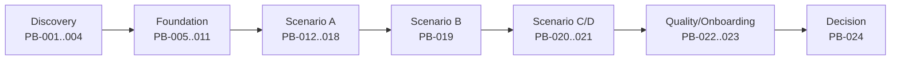

# プロダクトバックログ

## 1. 優先順位

P0はPoC開始または責任境界に必須、P1はシナリオ評価に必須、P2は追加学習項目。詳細な金融業務仕様が未確定の項目はDiscoveryとして扱う。

| ID | Pri | Backlog item | 完了条件 | 依存 | 目的 |
|---|---|---|---|---|---|
| PB-001 | P0 | PoCガバナンスとRACI確定 | 承認者、公開権限、例外手続きが承認済み | OQ-01 | OBJ-04 |
| PB-002 | P0 | 対象商品の業務要件Discovery | 項目、選択肢、ルール、文言、マッピングが出典付き | OQ-02〜04 | OBJ-01 |
| PB-003 | P0 | データ分類・脅威分析 | DFD、脅威、対策、PoCデータ方針が承認済み | OQ-05,11 | OBJ-04 |
| PB-004 | P0 | 評価プロトコル凍結 | 対照、担当、計時、除外、暫定目標が承認済み | OQ-08 | OBJ-01〜05 |
| PB-005 | P0 | Form Definition Schema v0 | FD-001〜014とFDV-001〜010を自動検証 | PB-002 | OBJ-02〜04 |
| PB-006 | P0 | Rule DSL/Engine v0 | 決定的評価、型検査、循環検出、結果説明 | PB-005 | OBJ-02,04 |
| PB-007 | P0 | 版付きDefinition Registry | 状態遷移、不変公開版、hash検証、取得API | PB-005 | OBJ-03,04 |
| PB-008 | P0 | スマホForm Runtime | 主要項目、分岐、検証、進捗、確認を描画 | PB-005,006 | OBJ-01,06 |
| PB-009 | P0 | サーバー再検証・セッション | 版固定、保存、冪等送信、障害復帰 | PB-006 | OBJ-04,06 |
| PB-010 | P0 | AI生成台帳 | 入出力由来、採否、修正量、hashを記録 | PB-004 | OBJ-01,05 |
| PB-011 | P0 | CI品質ゲート | G-01〜G-08が機械可読で強制される | PB-005,006 | OBJ-04 |
| PB-012 | P1 | 審査APIスタブとAdapter | 正規モデルから契約変換し契約試験合格 | OQ-03 | OBJ-03,04 |
| PB-013 | P1 | 要件構造化プロンプト/評価セット | 曖昧点・仮定を明示し固定課題で評価 | PB-002,010 | OBJ-01 |
| PB-014 | P1 | 変更影響分析 | 参照・経路・API・テスト差分を出力 | PB-005,006 | OBJ-02,05 |
| PB-015 | P1 | テスト生成とカバレッジ | 決定表、境界、経路、回帰を生成・集計 | PB-006,011 | OBJ-04 |
| PB-016 | P1 | トレーサビリティ検査 | 要件-定義-ルール-テストの欠落を失敗化 | PB-011 | OBJ-04,05 |
| PB-017 | P1 | UXイベントと評価ログ | METとUX補助指標をPIIなしで再計算可能 | PB-004,008 | OBJ-01,02,06 |
| PB-018 | P1 | Scenario A実施 | SC-A-01〜04の証跡凍結 | P0群 | OBJ-01〜06 |
| PB-019 | P1 | Scenario B実施 | 9変更を独立計測、複合回帰も完了 | PB-018 | OBJ-02,04 |
| PB-020 | P1 | Scenario C実施 | 2商品を同一ランタイムで公開・分離 | PB-019 | OBJ-03 |
| PB-021 | P1 | Scenario D実施 | ブランド/認証/API差分をアダプター化 | PB-020 | OBJ-03 |
| PB-022 | P1 | 新規担当者試験 | 指定小変更を独力でゲート合格 | PB-019 | OBJ-05 |
| PB-023 | P1 | WCAG/実機/ユーザビリティ検証 | 主要導線の重大違反0、課題台帳化 | PB-008 | OBJ-06 |
| PB-024 | P1 | PoC判定レポート | 全MET、限界、リスク、推奨判断を再現可能に提示 | PB-018〜023 | OBJ-01〜06 |
| PB-025 | P2 | 管理UI仮説 | Git方式との統制・効率比較 | PB-019 | OBJ-02,05 |
| PB-026 | P2 | 多言語・高度なUX実験 | 対象顧客決定後に評価 | OQ-06,07 | OBJ-06 |

## 2. 推奨実施順

## 3. Definition of Done

全項目共通で、受入条件、要件ID、テスト、セキュリティ影響、アクセシビリティ影響、運用・監査、文書更新、生成由来、レビュー記録が揃い、該当ゲートを通過していること。PoC用仮定は本番要件と明確に区別する。

