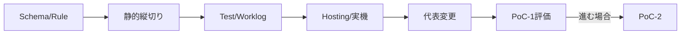

# プロダクトバックログ

## PoC-1 P0

| ID | 項目 | 完了条件 | 目的 |
|---|---|---|---|
| PB1-001 | ローカル開発環境とFirebase Hosting最小設定 | ローカルbuildと必要時deploy手順 | OBJ-01 |
| PB1-002 | JSON Schema v0 | FD-001〜007と不正例を検証 | OBJ-02,04 |
| PB1-003 | 最小ルール評価 | 9演算子・4種別のUnit合格 | OBJ-03,04 |
| PB1-004 | スマホフォームUI | 本人・勤務先・契約、確認・完了 | OBJ-01,07 |
| PB1-005 | 仮想商品定義 | 15〜25項目、3〜5分岐 | OBJ-01,02 |
| PB1-006 | ブラウザ/ローカルAPIスタブ | 合成結果で完了画面へ進む | OBJ-01 |
| PB1-007 | Unit/E2E/GitHub Actions | Schema、ルール、代表経路、build | OBJ-04 |
| PB1-008 | Codex作業手順とworklog雛形 | 必須記録項目をMarkdownで残せる | OBJ-02,06 |
| PB1-009 | Firebase Emulator Suite | 採用サービスをローカルで試験可能 | OBJ-01 |
| PB1-010 | Firebase最小サービス決定 | 必要性、料金、無料枠、概算を記録 | OBJ-01 |
| PB1-011 | Firestore Security Rules | Firestore採用時のみRulesテスト合格 | OBJ-04 |
| PB1-012 | Functions最終検証・冪等性 | Functions採用時のみEmulatorで合格 | OBJ-04 |
| PB1-013 | コスト運用手順 | 予算通知、利用量確認、削除手順を文書化 | OBJ-01 |
| PB1-014 | Scenario SC1-01〜05 | 変更別KPIと回帰結果を記録 | OBJ-03,04 |
| PB1-015 | PoC-1評価 | KPI、問題、PoC-2判断を記録 | OBJ-01〜07 |

PB1-011/012は条件付きP0であり、Firestore/Functionsを採用しなければ非該当と記録する。最初はPB1-002〜008の静的縦切りを優先する。

## PoC-2 P1

- PB2-001: 2商品目と商品差分
- PB2-002: 別銀行ブランド・文言差分
- PB2-003: APIマッピング差分
- PB2-004: 合成データの途中保存・再開
- PB2-005: 必要な場合のみAuthentication、Firestore、Functions、App Check
- PB2-006: 簡易UXイベントと少人数テスト
- PB2-007: 必要性が確認できた場合だけ簡易設定画面

## P2／本番化時

Definition Registry、本格管理画面、多人数承認、本格監査・生成台帳、署名・鍵管理、大規模マルチテナント、SLA/DR、実銀行接続、正式適合を候補とする。PoC-1では着手しない。

## 推奨順

