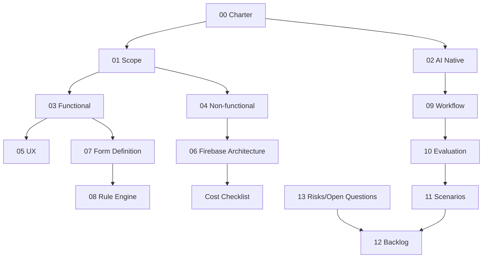

# AI Native銀行カードローン申込PoC

## このリポジトリについて

本リポジトリは、業務外の個人開発として開発者1名がCodexを主な作業主体に実施する技術検証である。仮想銀行、仮想商品、合成データ、APIスタブだけを使用し、実在顧客、実在銀行の非公開情報、審査情報、与信判断を扱わない。

本PoCは銀行向け本番システムではない。本番導入、実銀行接続、実顧客利用、法令・銀行規程への正式適合、本番認定を目的としない。公開画面にもこの制約を表示する。

## 目的

個人開発・Firebase Blazeプランの無料利用枠を意識した制約下で、Codexを開発主体とし、要件整理、設計、実装、テスト、文書更新、変更影響分析を一貫して行うAI Native開発方式によって、柔軟で保守しやすい銀行カードローン申込フォームのプロトタイプを構築できるか検証する。

## 2段階

- PoC-1: 仮想銀行1行・1商品、15〜25項目、3〜5分岐の縦切りプロトタイプを完成させる。
- PoC-2: PoC-1の振り返り後に、商品変更、2商品目、別銀行模擬、途中保存、UX計測を追加する。

## 文書マップ

| 文書 | 内容 |
|---|---|
| [00_poc_charter.md](00_poc_charter.md) | 個人開発PoCの目的と成功条件 |
| [01_scope.md](01_scope.md) | PoC-1、PoC-2、本番化時の境界 |
| [02_ai_native_definition.md](02_ai_native_definition.md) | Codex・決定的処理・人間の役割 |
| [03_functional_requirements.md](03_functional_requirements.md) | 段階別の機能要件 |
| [04_non_functional_requirements.md](04_non_functional_requirements.md) | 小規模PoCの品質・コスト要件 |
| [05_ux_principles.md](05_ux_principles.md) | スマホ・離脱防止・簡易評価 |
| [06_system_architecture.md](06_system_architecture.md) | Firebase中心の最小構成 |
| [07_form_definition.md](07_form_definition.md) | JSON Schema v0の最小契約 |
| [08_rule_engine.md](08_rule_engine.md) | 限定ルールとテスト |
| [09_ai_development_workflow.md](09_ai_development_workflow.md) | Codex主体の10段階フロー |
| [10_poc_evaluation_plan.md](10_poc_evaluation_plan.md) | 個人計測用KPIと記録形式 |
| [11_change_scenarios.md](11_change_scenarios.md) | PoC-1/2の変更検証 |
| [12_product_backlog.md](12_product_backlog.md) | 最小P0バックログ |
| [13_risks_and_open_questions.md](13_risks_and_open_questions.md) | 個人PoC向けリスクと未決事項 |
| [cost_checklist.md](cost_checklist.md) | Blaze利用量・予算・終了時確認 |
| [worklogs/README.md](worklogs/README.md) | 作業時間・Codex指示・修正・テストの記録雛形 |
| [../AGENTS.md](../AGENTS.md) | Codexが毎回守る永続的な作業ルール |

## 決定事項

- `bank_id`、`product_id`、`form_version` は単純な設定値として維持する。
- フォーム定義はGitHubで版管理し、PoC-1ではビルド時に取り込む。
- 項目は `sections[].fields[]` に格納し、ルート直下に `fields` を持たない。
- 条件ルールと名前付き項目バリデーターを分離し、任意正規表現・任意コードを許可しない。
- AI推論を申込実行・判定経路へ入れない。
- ルールは限定演算子で決定的に実行し、Node.jsの自動テストでも同じ実装を使う。
- Blazeプランを使用するが月額0円を目標とし、通常開発はEmulator Suiteで行う。
- Firestore、Functions、Authentication等は必要性を確認してから追加する。課金可能性のある追加をCodexだけで決定しない。
- Gitコミット、定義ハッシュ、自動テスト、簡易worklogを検証証跡とする。

## Firebase料金情報

公式情報を2026-07-24に確認した。Blazeは従量課金で無料利用枠を含むが、超過分は課金される。予算通知は支出上限ではない。数値を使う場合は確認時点の参考値とし、コードへ固定しない。

- Firebase料金プラン: https://firebase.google.com/docs/projects/billing/firebase-pricing-plans
- Hosting料金・利用量: https://firebase.google.com/docs/hosting/usage-quotas-pricing
- Firestore料金: https://firebase.google.com/docs/firestore/pricing
- Functions割当: https://firebase.google.com/docs/functions/quotas
- Emulator Suite: https://firebase.google.com/docs/emulator-suite
- Cloud Billing予算: https://cloud.google.com/billing/docs/how-to/budgets

## 次の最小ゴール

`sections[].fields[]` を採用するフォーム定義JSON Schema v0、仮想商品の代表項目、条件ルール、9種の名前付きバリデーター、required/visibility/navigation規則とNode.js Unitテストを先に作り、スマホ向け1セクションの最小縦切りへ接続する。Firebaseサービスの追加やクラウド公開は、その縦切りがローカルで動いてから行う。
