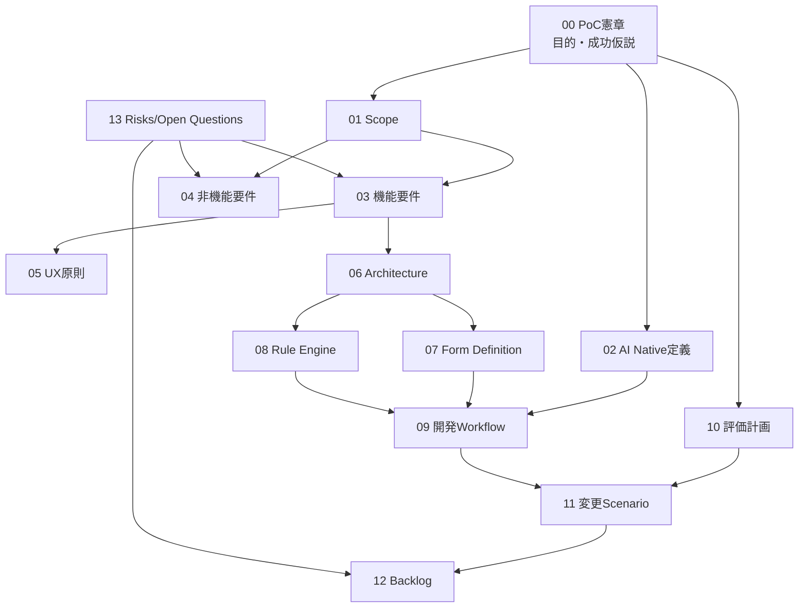

# AI Native銀行カードローン申込PoC 設計ベースライン

## 1. 現在地

本ディレクトリは、本格実装前の企画・設計ベースラインである。2026-07-24時点の調査では、作業場所 `C:\Users\la_sp` はGitリポジトリではなく、既存の `docs` および対象ファイルは存在しなかった。環境制約でホーム直下の全列挙はできなかったため、対象ファイルを個別確認して新規作成した。

本書群は金融商品・法令・審査要件を確定するものではない。不明点は仮定または [未決事項](13_risks_and_open_questions.md) として分離した。

## 2. 文書マップ

| 文書 | 正とする情報 |
|---|---|
| [00_poc_charter.md](00_poc_charter.md) | 目的、仮説、成功条件、統制 |
| [01_scope.md](01_scope.md) | PoC内外の境界 |
| [02_ai_native_definition.md](02_ai_native_definition.md) | AI・決定的プログラム・人間の責任 |
| [03_functional_requirements.md](03_functional_requirements.md) | 機能要件と受入条件 |
| [04_non_functional_requirements.md](04_non_functional_requirements.md) | 非機能のPoC基準と検証 |
| [05_ux_principles.md](05_ux_principles.md) | 離脱防止、アクセシビリティ、UX計測 |
| [06_system_architecture.md](06_system_architecture.md) | 境界、コンポーネント、主要データ |
| [07_form_definition.md](07_form_definition.md) | 実行可能仕様のメタモデル |
| [08_rule_engine.md](08_rule_engine.md) | 決定的ルール、評価順、テスト |
| [09_ai_development_workflow.md](09_ai_development_workflow.md) | 生成・検証・承認・公開フロー |
| [10_poc_evaluation_plan.md](10_poc_evaluation_plan.md) | 指標の式、データ源、比較、記録 |
| [11_change_scenarios.md](11_change_scenarios.md) | Scenario A〜Dの実施・計測 |
| [12_product_backlog.md](12_product_backlog.md) | 優先順位、依存、完了条件 |
| [13_risks_and_open_questions.md](13_risks_and_open_questions.md) | リスク、未決事項、期限目安 |

## 3. ID体系と追跡

- 目的: `OBJ-*`
- スコープ: `SCP-*` / `OOS-*`
- 機能・非機能: `FR-*` / `NFR-*`
- UX・アーキテクチャ・定義・ルール: `UX-*` / `ARC-*` / `FD-*` / `RULE-*`
- ワークフロー・シナリオ・バックログ: `WF-*` / `SC-*` / `PB-*`
- 評価・目標: `MET-*` / `TAR-*`
- リスク・未決: `RSK-*` / `OQ-*`

実装開始時は、フォーム定義の `requirement_refs`、ルールの `test_refs`、テストメタデータを使って `OBJ → FR/NFR → FD/RULE/ARC → TEST → MET` の追跡表を自動生成する。

## 4. 決定事項

| ID | 決定 |
|---|---|
| DEC-01 | PoCは1銀行1商品から始め、内部キーはbank/product/form versionを必須とする |
| DEC-02 | フォーム定義を実行可能仕様とし、公開時に解決済み不変スナップショットを作る |
| DEC-03 | AIは開発支援に限定し、表示・必須・検証・遷移・審査判断を実行時AIへ委ねない |
| DEC-04 | クライアント検証はUX補助、サーバーの決定的再検証を正とする |
| DEC-05 | AI生成物は自動ゲートと変更種別に応じた人間承認なしに公開しない |
| DEC-06 | PoCは合成データと審査APIスタブを使用し、本番認定と分離する |
| DEC-07 | 銀行・商品差分は定義とアダプターへ局所化し、公開時に差分を解決する |
| DEC-08 | 評価は事前登録したイベント、worklog、生成台帳、CI、欠陥台帳から再現可能に行う |

## 5. 主要な仮定

- 仮想の標準カードローン項目で基盤設計を進められるが、正式商品要件とは扱わない。
- PoCではYAML編集→正規化JSON公開を候補とする。
- 保存再開、認証、同意、API契約はスタブまたは短期セッションで境界を検証する。
- WCAG 2.2 AAを目標とするが、本番適合宣言は別工程とする。

## 6. 未決事項

最優先は対象商品/RACI、正式項目・ルール、審査API、同意文、データ取扱い、比較ベースライン、適用法令・セキュリティ基準である。優先度、決定者候補、期限目安は [13_risks_and_open_questions.md](13_risks_and_open_questions.md) のOQ-01〜15を参照する。

## 7. 次に着手すべき作業

1. PB-001〜004のDiscoveryを行い、OQ-01〜05、08、10、11を責任者と確定する。
2. 同一の確定要件を使う評価プロトコルと従来方式の比較基準を凍結する。
3. `schema/` にForm Definition JSON Schema v0、`examples/` に合成データの商品定義、`tests/` に検証用テストベクトルを作る。
4. Rule DSLのADRを作成し、許可演算子、null、日付、金額、優先順位を確定する。
5. Scenario Aの縦切りとして「開始→1セクション→分岐→確認→APIスタブ」を実装する。

推奨する次のゴールは「Discovery結果と評価プロトコルを承認し、Form Definition Schema v0とRule DSL ADRを自動テスト付きで完成させる」である。本格UI実装より先に、変更容易性と統制の核を検証できる。

## 8. 整合性レビュー観点

- 目的OBJ-01〜06は機能・非機能・バックログ・評価指標へ紐づく。
- AI実行責任は02、実装境界は06、公開統制は09で矛盾なく分離されている。
- PoC対象外は01、本番追加事項は04/06に明示されている。
- 評価指標MET-01〜11には式、ログ、比較、記録先がある。
- Scenario A〜Dは11で個別測定され、12の実施項目へ接続されている。
- 未確定の法令、審査、認証、セキュリティは13へ集約され、本文から参照されている。

