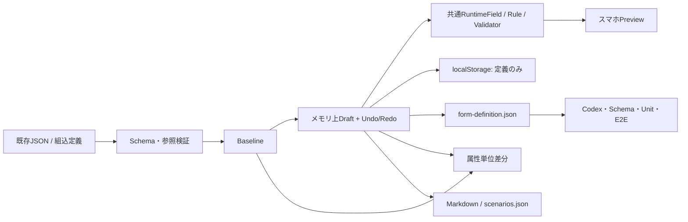

# Studioデータフロー

```mermaid
flowchart LR
  IMPORT[既存JSON / 組込定義] --> GATE[Schema・参照検証]
  GATE --> BASE[Baseline]
  BASE --> DRAFT[メモリ上Draft + Undo/Redo]
  DRAFT --> RUNTIME[共通RuntimeField / Rule / Validator]
  RUNTIME --> PREVIEW[スマホPreview]
  DRAFT --> LOCAL[localStorage: 定義のみ]
  DRAFT --> JSON[form-definition.json]
  BASE --> DIFF[属性単位差分]
  DRAFT --> DIFF
  DRAFT --> DOC[Markdown / scenarios.json]
  JSON --> CODEX[Codex・Schema・Unit・E2E]
```

申込者回答はPreviewのメモリだけに保持し、localStorageへ保存しない。ブラウザからリポジトリやFirebaseへ書き込まない。Import成功時の定義を新しいBaselineとし、不正Importでは現在Draftを保持する。
